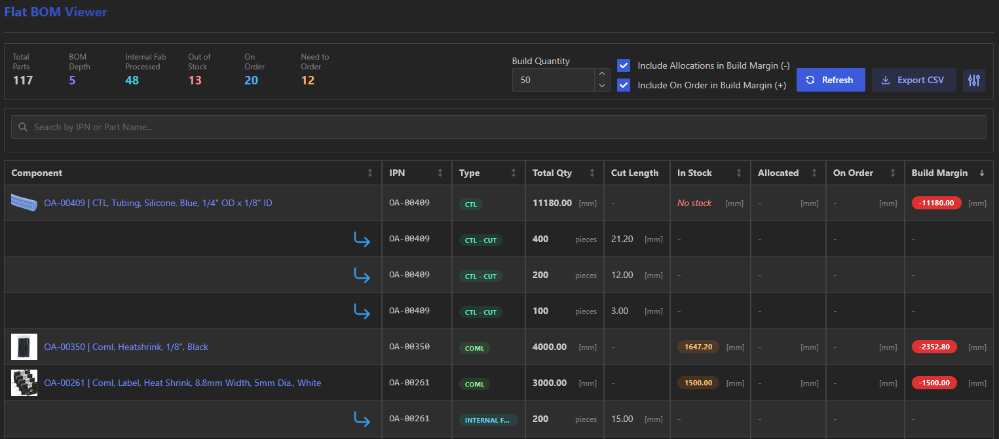
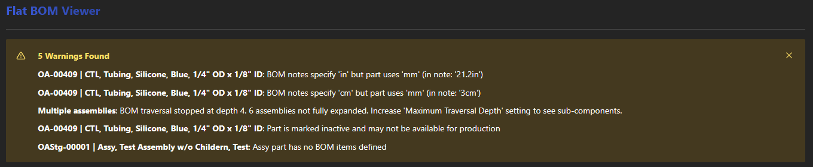
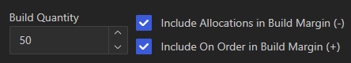
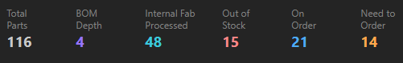
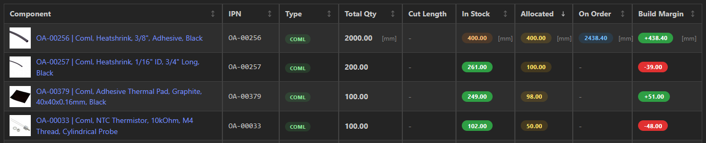

# Flat BOM Generator for InvenTree

**Version:** 0.9.2 | **InvenTree:** 1.1.6+

> Personal project for automated flat BOM generation. Currently in testing phase and undergoing refactoring to improve code quality. Feedback and bug reports welcome!

InvenTree plugin that flattens nested bill of materials into a single-level view of purchaseable components with automatic quantity aggregation. **The plugin is accessed via a "Flat BOM" panel on the part detail page of any assembly.**

## What This Plugin Adds

InvenTree's built-in BOM view shows the hierarchical structure. This plugin **flattens** that hierarchy into a purchasing-focused view by:

### Core Functionality

- **Automatic Leaf-Part Extraction**: Traverses the entire BOM tree and extracts only the purchaseable leaf components (Fab Parts, Commercial Parts, Purchaseable Assemblies), filtering out intermediate assemblies
- **Quantity Deduplication**: When a part appears multiple times in different branches of the BOM, automatically aggregates the total quantity needed
- **Cut-to-Length Part Support**: Custom handling for cut-to-length raw materials (wire, tubing, bar stock) with per-cut quantity breakdown
- **Flexible Build Margin Planning**: Toggle between optimistic (ignore allocations) and realistic (account for allocated stock) planning modes
- **On-Order Awareness**: Choose whether to include incoming purchase orders in your Build Margin calculations

### User Interface

- **Single-Page View**: See all purchaseable components in one table instead of navigating through BOM levels
- **Interactive Controls**: Adjust build quantity and instantly see scaled requirements across all parts
- **Planning Toggles**: Switch between planning scenarios (with/without allocations, with/without on-order) in real-time
- **CSV Export**: Export the complete flat BOM with all calculated quantities for purchasing workflows

*Screenshot: Main panel view with controls and BOM table*  


### Warning System

The plugin automatically detects and flags potential BOM issues:

- **Unit Mismatch Detection**: Flags when parts at the same BOM level use different units (e.g., mixing "pcs" and "grams")
- **Inactive Part Detection**: Warns when BOM contains inactive parts that may not be orderable
- **Assembly Without Children**: Identifies assemblies marked as assemblies but with no BOM items defined
- **Max Depth Exceeded**: Alerts when BOM traversal hits the configured depth limit (prevents infinite loops)

Warnings appear in a summary panel and help identify data quality issues before manufacturing.
*Screenshot: warnings at top of table*  


### Why This Matters

When planning a build, you typically need to answer: "What parts do I need to order?" InvenTree's hierarchical BOM view requires manual traversal and calculation. This plugin automates that process by:

1. Traversing multi-level BOMs automatically
2. Aggregating duplicate parts across branches
3. Calculating cumulative quantities through the hierarchy
4. Presenting a single, actionable purchasing list

### Performance Note

**Each generation request performs a complete recursive BOM traversal with no caching.** For large assemblies (1000+ parts, 10+ levels deep), this can take several seconds. The plugin:
- Traverses every part in the BOM hierarchy from scratch
- Calculates cumulative quantities through all levels
- Filters and deduplicates results

Consider using the optional `max_depth` parameter for very deep BOMs to limit traversal depth if appropriate.

## Installation

### Install from GitHub

Add the following line to your InvenTree `plugins.txt` file (or install directly via pip):

```bash
git+https://github.com/jrobelia/inventree-flat-bom-generator.git
```

Then restart InvenTree and enable the plugin:

1. Navigate to **Settings → Plugins** in InvenTree
2. Find "Flat BOM Generator" in the list
3. Toggle to enable
4. Restart InvenTree

## Configuration

After enabling the plugin, configure it in **Settings → Plugins → Flat BOM Generator**:

### Plugin Settings

| Setting | Description | Default |
|---------|-------------|---------|
| **Maximum Traversal Depth** | Maximum depth to traverse BOM hierarchy. Set to 0 for unlimited depth. Use positive values (e.g., 5) to limit traversal for very deep BOMs and improve performance. | `0` (unlimited) |
| **Expand Purchased Assemblies** | When enabled, expands the BOM for assemblies that have a default supplier (normally treated as purchaseable units). Useful to see internal components of purchased sub-assemblies. | `False` |
| **Primary Internal Supplier** | Your primary internal manufacturing company/supplier. Parts with this supplier will be categorized as Internal Fab and automatically expanded during traversal. | None |
| **Additional Internal Suppliers** | Comma-separated list of additional internal supplier IDs (e.g., "5,12"). Parts with these suppliers are also treated as internal. Leave empty if you only have one internal supplier. | Empty |
| **Fabrication Category** | InvenTree category for fabricated parts. Parts in this category (or child categories) will be classified as Fab or Internal Fab. Required for proper categorization. | None |
| **Commercial Category** | InvenTree category for commercial/COTS parts. Parts in this category (or child categories) will be classified as Coml. Required for proper categorization. | None |
| **Cut-to-Length Category** | InvenTree category for cut-to-length raw materials (wire, bar stock, etc.). Parts in this category with length in BOM notes will be classified as CtL. Optional but recommended if you use cut-to-length parts. | None |
| **Enable Internal Fab Cuts** | When enabled, parts categorized as Internal Fab with cut-to-length data will have their cuts aggregated and displayed. | `False` |
| **Internal Fab Cut Units** | Unit to use for internal fab cut list aggregation (e.g., "mm", "inch", "cm"). Only applies when Enable Internal Fab Cuts is enabled. | `mm` |

**Note:** See the "Category Configuration Behavior" section below for detailed part categorization logic.

### Cut-to-Length Part Support

**Feature Overview**: The plugin provides custom support for cut-to-length (CtL) raw materials like wire, tubing, and bar stock.

**Important Limitation**: This is a **workaround** to InvenTree's standard part system and does not integrate with InvenTree's built-in inventory or stocking features. CtL parts will not act correctly inside of InvenTree's stock levels, allocations, or purchasing workflows in terms of qty at cut length.  They can still be used to order in bulk.

**Intended Use Case**:
Assemblies with cut lists that specify raw material quantities by cut length:
- Example: "Qty 5 @ 30 inches" means 5 pieces, each 30 inches long
- Example: "Qty 8 @ 21.20 mm" means 8 pieces, each 21.20 mm long

**How It Works**:
1. Create a part in the Cut-to-Length category (configured in plugin settings)
2. Add the part to your assembly BOM
3. In the BOM line item **note field**, specify cut lengths in the format: `length: XX [unit]`
4. The plugin will:
   - Display the parent material with total quantity needed
   - Show child rows for each cut length with piece counts
   - Scale piece counts automatically with build quantity

**Example BOM Structure**:
```
Parent: OA-00409 | CTL Tubing, Silicone, Blue, 1/4" OD x 1/8" ID
  Total Qty: 11180.00 [mm]
  
  Child: CTL - CUT
    8 pieces × 21.20 [mm] (for 1 unit) → 400 pieces (for 50 units)
  
  Child: CTL - CUT  
    4 pieces × 12.00 [mm] (for 1 unit) → 200 pieces (for 50 units)
```

**Limitations**:
- CtL parts do not show up as cut pieces in InvenTree stock levels
- Cannot create purchase orders directly from CtL cut requirements
- No integration with InvenTree's allocation system
- Manual tracking required for raw material inventory

**When to Use**: Use CtL support when you need to track cut piece requirements for manufacturing planning, but manage raw material purchasing and inventory outside the plugin.

### Understanding Default Suppliers

**Critical Concept:** Default suppliers determine how assemblies are treated during BOM traversal.

**Why This Matters:**
- **External Default Supplier** → Assembly appears in flat BOM as a purchaseable unit (Purchased Assy)
- **Internal Default Supplier** → Assembly is expanded, showing its component parts (Internal Fab)
- **No Default Supplier** → Assembly is expanded, showing its component parts (Standard Assy)

**Example Scenarios:**

1. **PCBA with External Supplier**: A circuit board assembled by a contract manufacturer
   - `is_assembly` = TRUE
   - `default_supplier` = "ACME PCB Assembly Co"
   - **Result**: Appears in flat BOM as "Purchased Assy", BOM is NOT expanded
   - **Why**: You purchase it complete, don't need to buy individual resistors/capacitors

2. **Internal Fabrication Assembly**: A CNC machined part made in-house
   - `is_assembly` = TRUE  
   - `default_supplier` = Your internal supplier company
   - **Result**: Does NOT appear in flat BOM, BOM IS expanded
   - **Why**: Plugin shows raw materials needed (bar stock, etc.), not the fabricated part itself

3. **Standard Assembly**: A sub-assembly built in-house
   - `is_assembly` = TRUE
   - `default_supplier` = None
   - **Result**: Does NOT appear in flat BOM, BOM IS expanded
   - **Why**: Plugin shows component parts you need to order, not the sub-assembly

**Configuration Tip:** Set default suppliers correctly to control BOM traversal behavior. This is more important than category configuration for assemblies.

### Category Configuration Behavior

**Part Categorization Logic:**

The plugin categorizes parts based on category settings, assembly status, and default supplier:

| Part Type | Category | is_assembly | default_supplier | Appears in Flat BOM | Badge Color | Description |
|-----------|----------|-------------|------------------|---------------------|-------------|-------------|
| **Coml** | Commercial | FALSE | any/none | ✅ YES | Green | Off-the-shelf commercial parts |
| **Fab** | Fabricated | FALSE | any/none | ✅ YES | Blue | Machining, PCB fabrication |
| **CtL** | Cut-to-Length | FALSE | any/none | ✅ YES | Teal | Wire, bar stock (length in BOM notes) |
| **Purchased Assy** | any | TRUE | external | ✅ YES | Orange | PCBA, purchased complete with external supplier |
| **Internal Fab** | Fabricated | TRUE | internal | ❌ NO (expands) | Cyan | CNC, 3D print - BOM shows raw materials |
| **Assy** | any | TRUE | none/internal | ❌ NO (expands) | Violet | Standard assembly built in-house |
| **Other** | unconfigured | FALSE | any/none | ✅ YES | Gray | Parts not matching configured categories |

**Configuration Impact:**

**When all categories are configured:**
- Plugin uses InvenTree category hierarchy to classify parts
- Supports parent + child categories (entire tree)
- All part types correctly identified

**When categories are NOT configured:**
- **Assemblies still work**: Classification relies on `is_assembly` flag and default supplier
- **Non-assemblies become "Other"**: No category mappings means Coml, Fab, CtL cannot be identified
- **Recommendation**: Configure at minimum Fabricated and Commercial categories

**Partial configuration scenarios:**

| Categories Configured | What Works | What Doesn't |
|----------------------|------------|--------------|
| None | Purchased Assy, Internal Fab identification | Coml, Fab, CtL classification (all → "Other") |
| Fabricated only | Fab, Internal Fab, assemblies | Coml, CtL (→ "Other") |
| Commercial only | Coml, assemblies | Fab, CtL (→ "Other") |
| Fabricated + Commercial | Most parts classified correctly | CtL (→ treated as Fab) |
| All four categories | ✅ Full classification | None |

**Note:** The "Other" category means the plugin cannot determine the part type from available data. These parts will still appear in the flat BOM if they are leaf parts (non-assemblies without child BOMs).

## Usage

### Interactive UI Panel

The plugin adds a "Flat BOM Viewer" panel to assembly part pages:

1. **Navigate** to any assembly part in InvenTree
2. **Click** "Generate Flat BOM" to analyze the complete hierarchy
3. **Adjust** build quantity to see scaled requirements
4. **Toggle** allocation and on-order checkboxes to customize Build Margin calculation
5. **Search** and filter the results table
6. **Export** to CSV for further analysis or purchasing

### Controls

**Build Quantity**
- Set the number of units you plan to build
- All quantities scale automatically

**Include Allocations in Build Margin** (Checkbox)
- ✅ Checked: Build Margin based on available stock (total - allocations) - *Realistic view*
- ☐ Unchecked: Build Margin based on total stock - *Optimistic view*

**Include On Order in Build Margin** (Checkbox)  
- ✅ Checked: Incoming stock increases Build Margin - *Standard planning*
- ☐ Unchecked: Ignore incoming stock - *Conservative planning*

*Screenshot: Build quantity input and checkbox controls*  


### Statistics Panel

- **Total Parts**: Number of unique purchaseable components
- **Internal Fab Processed**: Number of Internal Fabricated Part assemblies expanded during BOM traversal
- **Out of Stock**: Parts with zero inventory
- **On Order**: Parts with incoming purchase orders
- **Need to Order**: Parts with Build Margin deficit (respects checkbox settings)

*Screenshot: Statistics panel with counters*  


### Table Columns

| Column | Description |
|--------|-------------|
| **Component** | Full part name with IPN prefix and variant (includes thumbnail image, clickable link) |
| **IPN** | Internal Part Number |
| **Description** | Part description |
| **Type** | Color-coded badge: Coml (green), Fab (blue), CtL (teal), Purchased Assy (orange), Internal Fab (cyan), Assy (violet), TLA (grape), Other (gray) |
| **Total Qty** | Required quantity for build (scales with build quantity) with [unit] |
| **In Stock** | Total inventory (green if sufficient, orange if partial, red if none) with [unit] |
| **On Order** | Incoming stock from purchase orders with [unit] (dimmed when checkbox unchecked) |
| **Building** | Stock currently in production builds (cyan badge if > 0) |
| **Allocated** | Stock reserved for builds and sales orders with [unit] (dimmed when checkbox unchecked) |
| **Available** | Stock available after subtracting allocations (green if sufficient, orange if partial, red if none) |
| **Build Margin** | Balance after build (negative red badge if deficit, positive green badge if surplus; respects allocation and on-order checkboxes) |

All columns are **sortable** and the table is **paginated** (10/25/50/100/All per page).

*Screenshot: BOM table showing all columns with various part types and stock levels*  


## How It Works

### BOM Traversal Algorithm

The plugin uses a recursive traversal with the `visited.copy()` pattern:

1. **Traverse**: Build complete BOM tree with cumulative quantities
   - Uses `visited.copy()` to allow same part in different branches
   - Detects and prevents circular references
   - Calculates cumulative quantities through multiplication

2. **Filter**: Extract only leaf parts (purchaseable components)
   - Coml: Commercial/COTS parts (non-assembly in Commercial category)
   - Fab: Fabricated parts (non-assembly in Fabrication category)
   - CtL: Cut-to-length materials (non-assembly in Cut-to-Length category with length in BOM notes)
   - Purchased Assy: Assemblies with external default supplier (purchased complete)

3. **Deduplicate**: Sum quantities for parts appearing multiple times
   - Groups by part_id
   - Aggregates cumulative quantities
   - Preserves metadata

### Stock Calculations

**Total Stock** = Physical inventory in InvenTree

**Allocated** = `allocation_count()` - Stock reserved for:
- Build orders (in production)
- Sales orders (promised to customers)

**Available** = Total Stock - Allocated

**Build Margin** = Stock Used + (On Order if enabled) - Total Required
- Where Stock Used = Available (if allocations enabled) or Total Stock (if disabled)
- Negative value indicates deficit (need to order)
- Positive value indicates surplus (extra stock after build)

## Future Work

### Refactoring Plans

**Current Status**: The plugin is functional but undergoing code quality improvements. Ongoing refactoring work includes:

- **Serializer Implementation**: Replacing manual dictionary construction with Django REST Framework serializers for improved type safety and maintainability
- **Test Coverage Expansion**: Adding integration tests for API endpoints and core BOM traversal functions (currently 106 tests with identified gaps)
- **Code Organization**: Breaking down large components and improving separation of concerns

### Feature Enhancements

These features are planned for future releases:

-**Support for optional parts**: Filtering out optional BOM items from flat BOM view?

-**Support for substitute parts**: Display substitutes some how in flat BOM view?

-**Support for consumable parts**: Filtering out of consumables from flat BOM view?


### Related Plugins (Planned)

This is the first of three planned plugins to enhance InvenTree's manufacturing planning capabilities for assemblies with nested sub-assemblies:

1. **Flat BOM Generator** (this plugin) - High-level planning and purchasing focused on generating actionable flat BOMs from assembly structures
2. **Build Order Generator** (planned) - Semi-automated build order creation from top-level build orders, with dependency tracking and scheduling
3. **Purchase Order Generator** (planned) - Automated PO generation based on flat BOMs, using default supplier logic and project-based part allocation

These plugins create actionable but temporary lists for manufacturing and purchasing workflows without modifying core InvenTree data structures.

